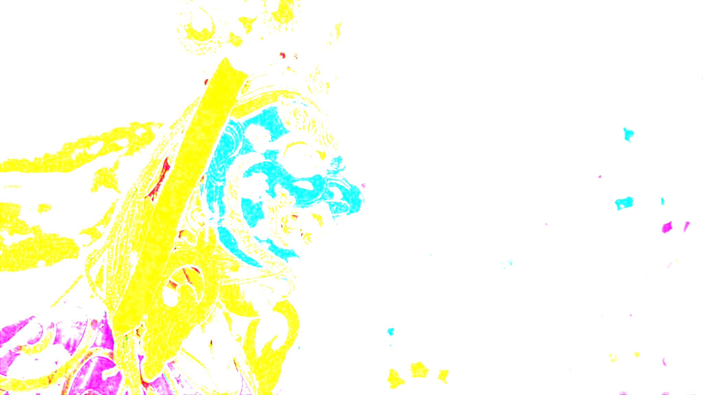
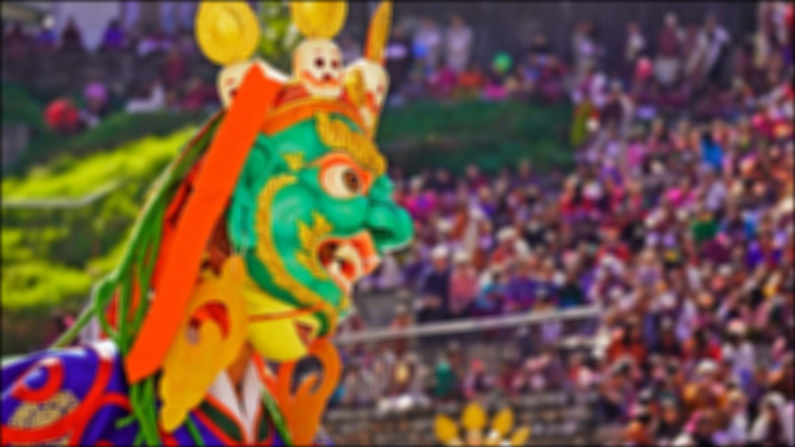
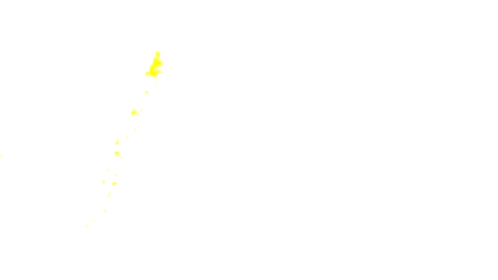
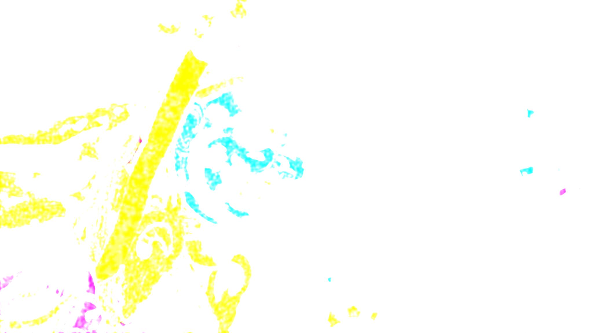
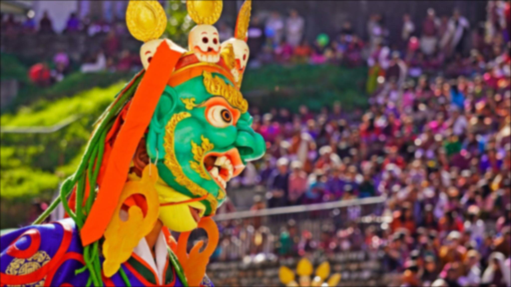
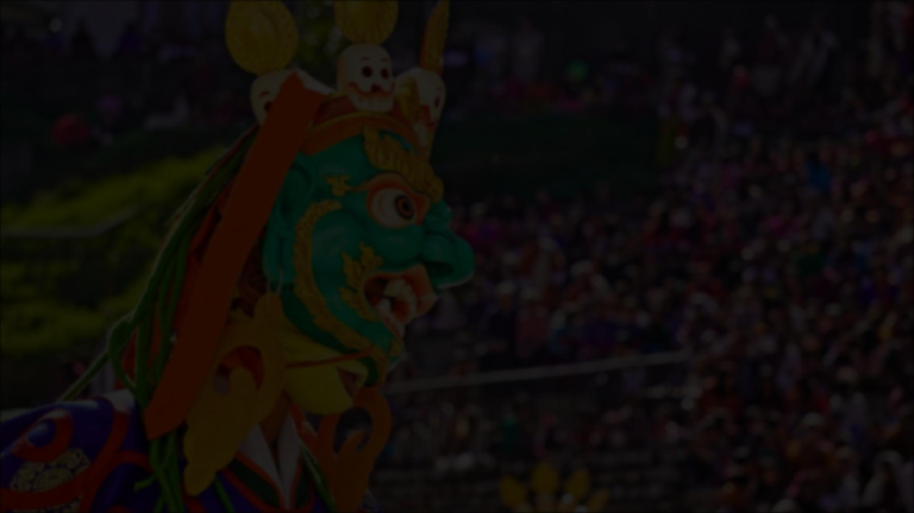
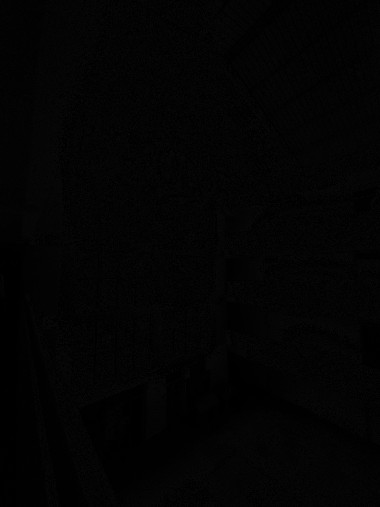

# Q4 – HDR Imaging (High Dynamic Range)

## Input Exposure Images  
| Bright | Medium | Dark |
|--------|--------|-------|
|  |  |  |

---

## HDR Output  
| Tone-Mapped HDR Result |
|------------------------|
|  |

---

## Question  
**HDR:** Compute an HDR image via:  
1. Estimation of the Camera Response Function (CRF)  
2. Computation of the irradiance/radiance map  
3. A global tone mapping algorithm  

Use the sample photos provided in the repository or your own (bright, medium, dark exposures).  
Your HDR pipeline should recover full scene radiance and convert it into a viewable LDR image.

---

## Explanation  
HDR imaging merges images taken at different exposures to overcome the limited dynamic range of cameras.  
- **CRF estimation** maps pixel intensities to real radiance levels.  
- **Irradiance reconstruction** combines exposures using weighted averaging.  
- **Tone mapping** compresses HDR values into displayable range while preserving details.  

This results in an image showing both highlights and shadows clearly.

---

---

# Q5 – Spatial Filtering (Box & Gaussian Filters)

## Original Image  

---

## 5×5 Box Filter  
| Normalized | Non-Normalized |
|-----------|----------------|
|  |  |

---

## 20×20 Box Filter  
| Normalized | Non-Normalized |
|-----------|----------------|
|  |  |

---

## Gaussian Filter (σ = 3)  
| Non-Normalized | Sum Normalized | Area Normalized |
|----------------|----------------|-----------------|
|  |  |  |

---

## Question  
Implement 5×5 and 20×20 box filters, with and without normalization, on the color image  
*Torgya – Arunachal Festival.jpg*.  

Compute σ, derive the Gaussian kernel size, and apply:  
- a separable Gaussian filter  
- a separable normalized Gaussian filter  

---

## Explanation  
A box filter replaces each pixel with the mean (normalized) or sum (non-normalized) of neighboring pixels.  
Larger kernels (20×20) produce heavier blur than smaller ones (5×5).  

Gaussian filtering performs weighted averaging:  
- **Non-normalized** Gaussian brightens the image.  
- **Sum-normalized** preserves brightness.  
- **Area-normalized** scales by window area.  

Gaussian filters produce smoother, more natural-looking blur compared to box filters.

---

---

# Q6 – Bit-Plane Slicing

## Low-Light Results  
| Original | Reconstructed (Bits 0–2) | Difference |
|----------|---------------------------|------------|
|  |  |  |

---

## Bright-Light Results  
| Original | Reconstructed (Bits 0–2) | Difference |
|----------|---------------------------|------------|
|  |  |  |

---

## Question  
Capture one image in low light and one in bright light.  
Extract all 8 bit-planes, reconstruct the image using bits 0–2, and compute the difference from the original.

---

## Explanation  
Each grayscale pixel is represented using 8 bits.  
- **Lower bits (0–2)** store coarse details.  
- **Higher bits (3–7)** store fine textures and important information.  

Reconstruction using only bits 0–2 produces a simplified image.  
The **difference** image highlights the information lost in higher bit-planes.  
Bright images usually contain stronger high-bit structure compared to low-light images.

---

## Reference Scripts  
- `hdr.py`  
- `boxfilter.py`  
- `gaussian_filter.py`  
- `bit_slicing.py`
